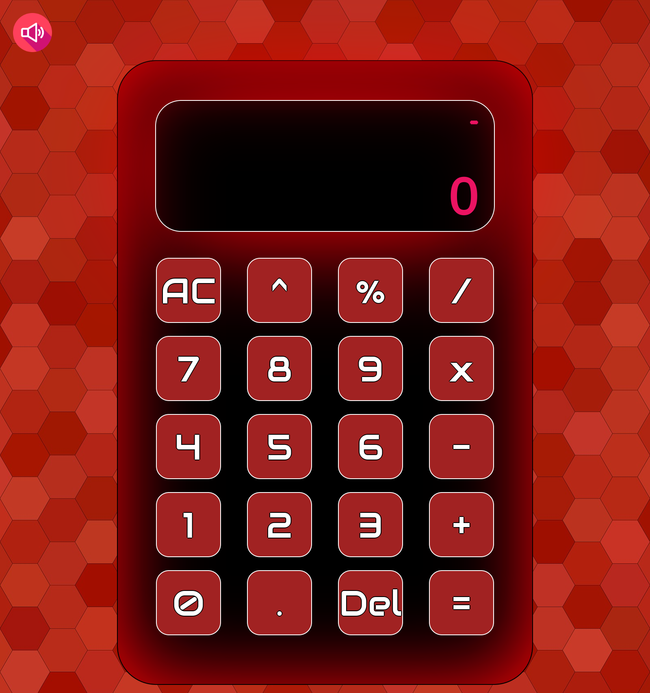
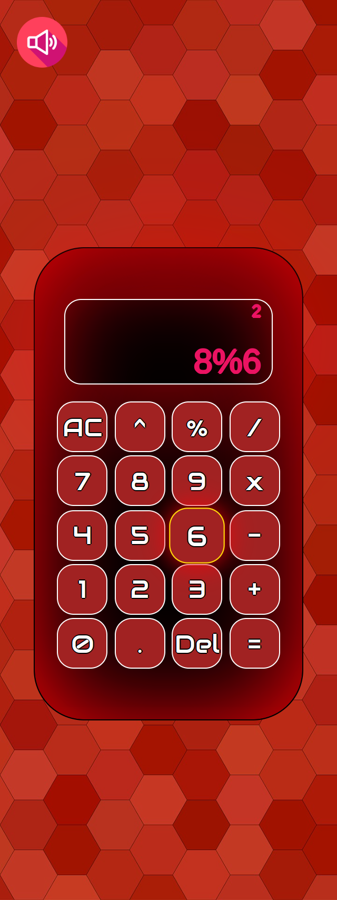

## Calculator

Calculator is a web calculator app made with Javascript, CSS and HTML.

## Deployment

Available live at: https://charbytesdev.github.io/calculator [not yet!]

## Features

- [x] Capable of ongoing binary calculations.
- [x] Capable of decimal calculations.
- [x] "AC" button to clear display.
- [x] "Del" button to undo last character.
- [x] Background music and button pressing sound effects (Mute button found on top left). [not yet]
- [x] Compatible with laptop and desktop screens (will be adapting to smartphones soon). [not yet]

 

 
 

## Built With

- [HTML](https://developer.mozilla.org/en-US/docs/Web/HTML) - Hyper Text Markup Language
- [CSS](https://developer.mozilla.org/en-US/docs/Web/CSS) - Cascading Style Sheets
- [JS](https://developer.mozilla.org/en-US/docs/Web/JavaScript) - Programming Language
